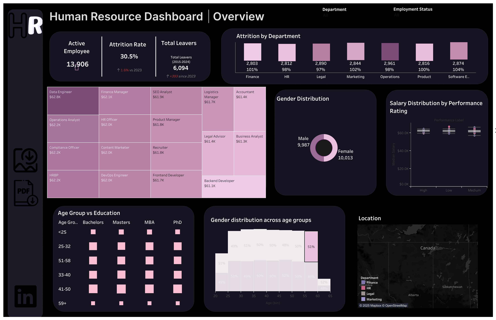

# Employee Insights (Mock Data)— HR Analytics Dashboard

A HR analytics dashboard built using Tableau, powered by synthetic employee data generated via Python's Faker library.

🔗 View Dashboard on Tableau Public

___

## Overview

This project showcases key HR metrics across departments, genders, and job roles using visual storytelling and clean UI design. The aim is to assist HR professionals in identifying trends and making data driven decisions.
___

## Built in Tableau Desktop

Design support using Figma (background layout)
Data generated using Python + Faker
___

## Dataset

**File: hr_dataset_sample.csv**
**Size: 20,000 synthetic employee records**
**Time Range: 2015–2024**

## Note: This is entirely fake data used only for learning and portfolio display purposes.

## Features included:
Employee ID
Department
Job Title
Gender
Education Level
Marital Status
Performance Score
Work Mode (Remote, Onsite, Hybrid)
Salary
...and more.

___

## Visualisations

**Key charts and KPIs include:**
Department-wise employee distribution
Gender ratio across job roles
Performance rating heatmaps
Work mode comparison (Remote vs Onsite vs Hybrid)
Salary distribution by department and education
___

## Tools & Tech

Tableau – Data visualization
Python (Faker library) – Synthetic data generation
Figma – Visual layout for background
___

### Author
Minal Urooj
